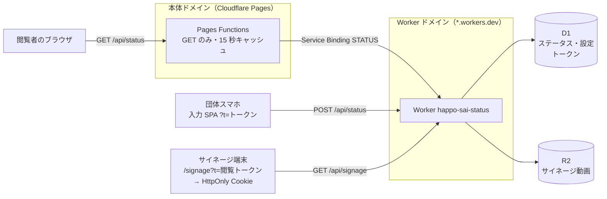

# ステータス入力アプリ

模擬店団体が「販売状況」（5 択）「混雑状況」（3 択）を送信するアプリと、その API (Cloudflare Workers + D1) です。  
本体サイト（Cloudflare Pages）の `/explore` は、Pages Functions ([apps/website/functions/api/[[path]].ts](../website/functions/api/%5B%5Bpath%5D%5D.ts)) の Service Binding 経由で同一ドメインの `/api/status` からデータを取得します。

## ローカル開発

コマンドはすべてリポジトリルートで実行します。

```sh
# 初回: ローカル D1 にスキーマを適用
bun run status:migrate -- --local
bun run status:seed

# 入力 SPA をビルドして Worker を起動
bun run status:dev
```

- シードが入れるトークンは 2 件だけです。`http://localhost:8787/?t=dev-token-c2-3`（2年次3組）と `http://localhost:8787/?t=dev-token-admin`（管理者）で開きます。
- 他の団体として開くには `bun run status:token` で全団体分を発行し、`apps/status/tokens.local.csv` の URL を使います（[トークン](#トークン)）。
- サイネージは管理者画面の「サイネージ設定」で閲覧 URL を発行して開きます。
- 本体サイトは `bun dev`（:5173）です。`/api` は vite の proxy で :8787 に転送されます。
- 入力 SPA 自体を開発するときは `bun run status:dev:spa` を使います（別ポートの vite dev で、API は proxy で :8787 へ転送されます）。

## デプロイ

### 初回

1. D1 を作成し、出力された `database_id` で [wrangler.jsonc](wrangler.jsonc) のプレースホルダーを置き換えます（コミットして問題ありません）。

   ```sh
   bunx wrangler d1 create happo-sai-status
   ```

2. サイネージ動画・音声用 R2 bucket を作成します（`wrangler.jsonc` の `bucket_name` と一致させます）。

   ```sh
   bunx wrangler r2 bucket create happo-sai-signage
   ```

3. 本番 D1 にスキーマを適用します。

   ```sh
   bun run status:migrate -- --remote
   ```

4. 全団体と管理者のトークンを発行し、`apps/status/tokens.remote.csv` の URL を配布します（[トークン運用](#トークン運用)）。

   ```sh
   bun run status:token -- --remote
   bun run status:token -- --remote --admin
   ```

5. Worker の手動デプロイです。

   ```sh
   bun run status:deploy
   ```

6. Cloudflare ダッシュボード → Pages プロジェクト → Settings → Bindings（Functions）で、変数名 `STATUS` → Worker `happo-sai-status` の Service Binding を追加します。忘れると本体の `/api/status` が 500 になります。

7. main を push します（Git 連携で Pages が再ビルドされ、`functions/` が有効になります）。

### 2回目以降

`migrations/` に SQL を追加したときだけ、push の前に `bun run status:migrate -- --remote` を実行します。

### 既存環境への token hash migration

`0007_hash_access_tokens.sql` は既存の平文トークンを削除します。以下を続けて実行する間アプリは一時的に利用できません。  
更新後は URL を配布し直す必要があります。

```sh
bun run status:migrate -- --remote
bun run status:token -- --remote
bun run status:token -- --remote --admin
```

### デプロイ後の確認

- `https://happo-sai.pages.dev/api/status` が JSON を返すか。
  - index.html が返る場合は、Pages Functions が未検出です。
  - 500 が返る場合は、Service Binding が未設定です。
- 更新されたステータスが公開サイトの `/explore/events/` に表示されるか（キャッシュ 15 秒 + ポーリング 45 秒で最大 60 秒かかります）。
- 本体ドメインへの `POST /api/status` が 405 か。
- push したコミットのデプロイが GitHub 上で成功しているか。

本体サイトは開催日当日以外は `/api/status` を呼びません。

## 運用

### トークン

平文は D1 に保存せず、SHA-256 ハッシュだけを `org_tokens.token_hash` と `admin_tokens.token_hash` に入れます。団体一覧は [shared/organizations.ts](../../shared/organizations.ts) から作ります。

```sh
bun run status:token                      # ローカル D1 に食品販売・調理の全団体
bun run status:token -- --remote          # 本番 D1 に全団体
bun run status:token -- --remote <org_id> # 指定した団体だけ差し替え
bun run status:token -- --remote --admin  # 管理者トークン
```

- 標準出力は `<org_id>` と `<token>` のタブ区切りです（wrangler の出力は標準エラーへ流すので、そのままパイプできます）。
- 同時に `apps/status/tokens.local.csv` / `tokens.remote.csv`（`id,name,url`）を書き出します。gitignore 済みですが、間違って公開しないように注視してください。
- `--admin` は `admin_tokens` に自然キーが無いため、既存の管理者トークンをすべて失効させてから 1 件だけ入れます。

### 管理者モード

管理者 URL でアクセスすると管理画面になります。ヘッダー右のタブで「ステータス」と「設定」を切り替えます。

- 「ステータス」は固定の grid で、ステータス送信（団体のセレクト付き）と更新履歴が横並びです。「設定」は同じ区切りの grid に「サイネージ」（フッター・閲覧 URL・動画・音声）と「ステータス」（受付時間・テスト受付）が並びます。テスト受付は確認モーダルから開始・終了します。
- 表示中のページ（`admin-page`）を localStorage に持ちます。
- ウィンドウは `container-type: inline-size` のコンテナで、中身は自分の幅だけを見てレイアウトを変えます（ビューポート幅ではありません）。
- 団体向けの送信画面も同じシェルを使います。ヘッダーは無く、ウィンドウはステータスだけです。

できることは次のとおりです。

- セレクトで団体を選んで、その団体のステータスを代理更新できます。
- 「更新履歴」で、その団体の販売状況・混雑状況の推移（新しい順に最大 200 件）を折れ線グラフで見られます。ドラッグで移動、ホイールで拡大、`Day 1` / `Day 2` でその日に絞り、ダブルクリックで全期間に戻ります。グラフの計算は [historyChart.ts](src/lib/historyChart.ts) にあります。
- ステータスを受け付ける団体は [shared/status.ts](../../shared/status.ts) の `STATUS_ORG_IDS`（`category` が `foodSales` / `cooking` の団体）で決め打ちです。他の団体は `POST /api/status` が 403 になり、公開サイトとサイネージにも出ません。サイネージはこの一覧を `org_id` 順で出します。
- サイネージの固定案内・速報、R2 の動画・音声、閲覧 URL を管理できます。
- 送信できる時間は「設定」の受付時間で決めます。未保存の日は [shared/timetable.ts](../../shared/timetable.ts) の `festivalDates` と `festivalHours`（両日 10:00-15:30）が初期値です（`submit_windows`）。
  - 時間外は団体トークンの `POST /api/status` が 403 になり、公開の `GET /api/status` は空配列を返します（本体サイトにステータスが表示されません）。

### サイネージ

- 16:9 レイアウトです。
- フッターは [shared/timetable.ts](../../shared/timetable.ts) のタイムテーブルから `<まもなく|開催中|次は> <時刻> <企画名 / 団体名> @ <会場>` を表示します。時刻はどの枠も `10:00-10:30` の形で出し、開始前の枠は開始 10 分前から出します。開催中の枠と次の枠を表示します。速報はどちらも上書きします。
- 開催日以外でフッターの見た目を確認するときは `/signage?at=2026-09-26T10:22`（端末のタイムゾーンで解釈）を付けます。
- 動画は MP4・最大 1 GiB、音声は MP3 / M4A・最大 64 MiB です。ブラウザから 16 MiB 単位の Multipart Upload で R2 に保存します。配信は `private, max-age=86400, immutable` です。
- `signage_config.video_start_at` を過ぎるまで動画を出さず `映像準備中` で待ちます。判定は 1 秒ごとです。null なら常に再生し、管理画面のプレビューは時刻を無視します。
- 音声は `signage_config.audio_start_at` を過ぎたときに 1 回だけ再生します。文化祭終了時刻を入れて使います。null なら再生せず、プレビューでも鳴りません。
- 自動再生は消音でしか始まらないため、端末で「音声を有効にする」を一度押しておく必要があります。動画と音声の両方に効きます。
- 設定とステータスは 60 秒間隔で更新され、取得失敗時は最後に成功した表示を維持します。

## スタイル

[Panda CSS](https://panda-css.com/) を使います。`.vue` から静的に抽出するので、`css()` / `cva()` にはリテラルを渡します。

- トークンとレシピは [theme/](theme/) にあり、[panda.config.ts](panda.config.ts) が読み込みます。生成物 `styled-system/` は `@styled/*` で参照し、gitignore 済みです（`bun run status:build` などが `panda codegen` を先に走らせます）。
- 条件付きのスタイルは `:class="[a, cond && b]"` ではなく `cva` の variant にします。並べても打ち消せず、勝つのは配列の順ではなく生成 CSS の順だからです。
- ダークが base で、`_osLight` が端末の設定に追従します。CSS だけで完結するのでスクリプトは要りません。サイネージが端末の設定に関わらずダークなのは、意味論トークンではなく `signage.*` で描いているからです。
- サイネージは表示専用のため、テーマに追従しない `signage.*` トークンを別に持ちます。

## アーキテクチャ



- 値の型は [shared/status.ts](../../shared/status.ts) を全体で共有します。
- 書き込み（`POST /api/status`）は Worker ドメインからのみできます。
- `GET /api/status`
  - Worker ドメイン（`*.workers.dev`）では 404 です。エッジキャッシュを迂回させないためです。
  - Pages Functions がエッジにキャッシュするので、D1 は最大 15 秒に 1 回しか読みません。
  - `STATUS_ORG_IDS` の団体だけを返します。

### API

| エンドポイント     | 認証                     | 内容                                       |
| ------------------ | ------------------------ | ------------------------------------------ |
| `GET /api/status`  | なし（本体ドメインのみ） | 全団体のステータス一覧                     |
| `GET /api/me`      | Bearer                   | トークンに対応する団体と現在値             |
| `POST /api/status` | Bearer                   | 自団体の `{ sales, congestion }` を UPSERT |
| `GET /api/history` | Admin Bearer             | 更新履歴（`?orgId=` で団体を絞る）         |
| `GET /api/signage` | Cookie / Admin Bearer    | サイネージ設定・対象団体・その最新値       |
| `PUT /api/window`  | Admin Bearer             | Day 1 / Day 2 の送信可能時間を保存         |
| `POST /api/test`   | Admin Bearer             | テスト受付を開始                           |
| `DELETE /api/test` | Admin Bearer             | テスト受付を終了し、テスト分を消す         |

管理者用の `/api/signage/*` では設定保存、閲覧 URL 発行、R2 Multipart Upload、動画・音声の選択と削除を行います。

#### 更新履歴

`POST /api/status` は `org_status` の UPSERT と `org_status_log` への INSERT を同じ `batch()` で書きます。`org_status` は団体ごとに 1 行しか持たないので、過去の値は `org_status_log` にだけ残ります。

- `source` は `org`（団体自身）か `admin`（管理者の代理更新）です。
- `0011_status_history.sql` は過去分を復元できないため、ログは空から始まります。
- 削除や期限切れはしません。
- テスト受付中は `test = 1` の行に書き、読み出しも同じ行だけを見ます。終了時に `test = 1` を削除するだけなので、本番の行には影響しません。

#### 各団体が持つ状態

- `sales`: `available | partial | low | paused | soldout`
  > `paused | soldout` は混雑状況を持ちません
- `congestion`: `low | medium | high`
